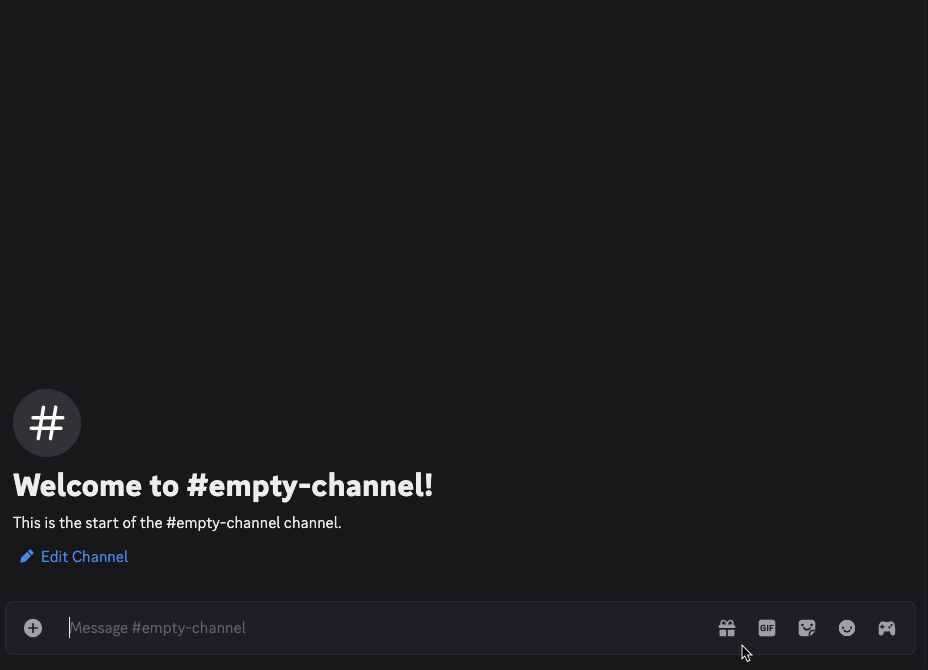

# Discord Log Tagger

A Discord bot for presenting the contents of an FFLogs report at a glance.

## Getting Started

### Requirements

- Python: 3.9+
- You'll have to register the bot using the [Discord Developer portal](https://discord.com/developers/applications) and grab a token for the bot. Instructions can be found [here](https://discordpy.readthedocs.io/en/stable/discord.html).
- You'll also need a client ID and secret from FFLogs. Instructions can be found [here](https://www.fflogs.com/api/docs). This bot uses the Client Credential Flow, meaning it can only generate embeds for public reports.

### Setup
 - Clone this repo onto your device.
 - (Optional) Start a virtual environment inside this repo.  
 - Run `pip install -r requirements.txt` from this repo to install dependencies.
 - Add the token from Discord as well as the FFLog client ID and secret as environment variables. A text file demonstrating a sample .env file is provided.
 - To start the bot, run the `bot.py` file.

### Adding the bot to a server
The [discord.py page](https://discordpy.readthedocs.io/en/stable/discord.html#inviting-your-bot) contains detailed instructions on generating an invite link to add the bot to a server. Below are the necessary permissions for the bot to function:
 - Under **Scopes**: 
   - bot
 - Under **Bot Permissions**:
   - Send Messages
   - Send Messages in Threads (Optional)
   - Use External Emojis
   - Use Slash Commands

 >[!Note]
 >By default, private bots can only be added to servers you've created. If you want to add it to a server you have admin permissions on, make sure to set the bot to public.
